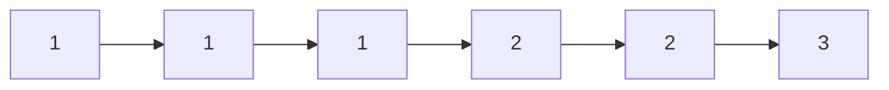
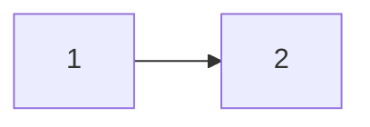
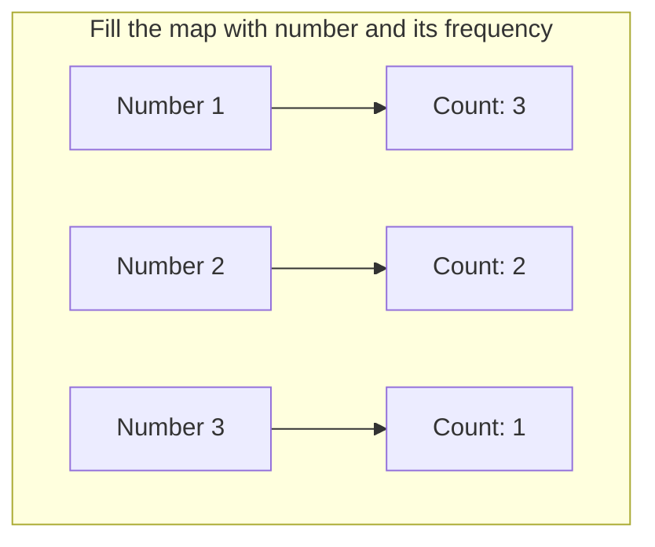
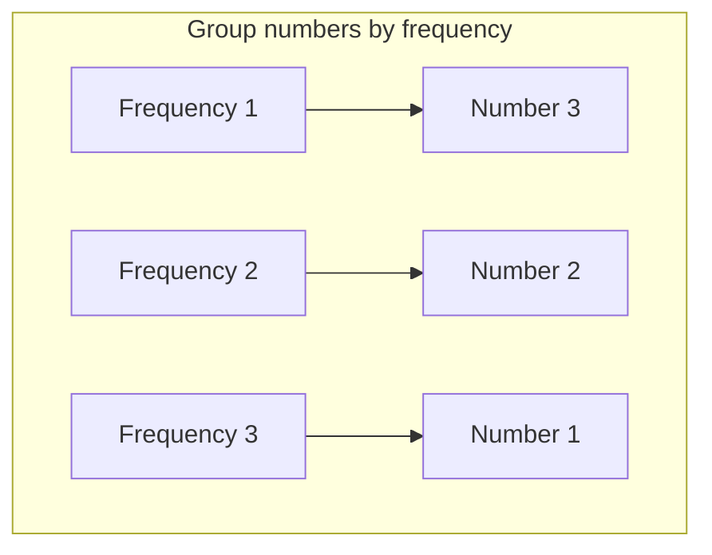

<h2><a href="https://leetcode.com/problems/top-k-frequent-elements">Top K Frequent Elements</a></h2> <hr><p>Given an integer array <code>nums</code> and an integer <code>k</code>, return <em>the</em> <code>k</code> <em>most frequent elements</em>. You may return the answer in <strong>any order</strong>.</p>

<p>&nbsp;</p>
<p><strong class="example">Example 1:</strong></p>
<pre><strong>Input:</strong> nums = [1,1,1,2,2,3], k = 2
<strong>Output:</strong> [1,2]
</pre><p><strong class="example">Example 2:</strong></p>
<pre><strong>Input:</strong> nums = [1], k = 1
<strong>Output:</strong> [1]
</pre>
<p>&nbsp;</p>
<p><strong>Constraints:</strong></p>

<ul>
	<li><code>1 &lt;= nums.length &lt;= 10<sup>5</sup></code></li>
	<li><code>-10<sup>4</sup> &lt;= nums[i] &lt;= 10<sup>4</sup></code></li>
	<li><code>k</code> is in the range <code>[1, the number of unique elements in the array]</code>.</li>
	<li>It is <strong>guaranteed</strong> that the answer is <strong>unique</strong>.</li>
</ul>

<p>&nbsp;</p>
<p><strong>Follow up:</strong> Your algorithm&#39;s time complexity must be better than <code>O(n log n)</code>, where n is the array&#39;s size.</p>


Sure! Let's go through your diagrams and explanations, and make the necessary corrections to the Mermaid syntax and overall flow.

### Input and Output:

These two diagrams are already correct. They show the input and output arrays clearly.

### Input:


### Output (for `k = 2`):


### Step-by-Step Algorithm Explanation:

#### First Step: Fill the Frequency Map

This diagram is mostly correct, but we will adjust the layout to ensure clarity and alignment of the steps.



#### Second Step: Group Numbers by Frequency

This step visually groups the numbers by their frequency.



### Third Step: Extract Top `k` Frequent Numbers

This diagram explains how the algorithm iterates in reverse order and collects the top `k` frequent numbers. Let’s make the flow more readable.

```mermaid
graph TD
    subgraph Step_3[Extract top k frequent numbers]
        V3[Frequency: 3] --> N1[Number: 1]
        V2[Frequency: 2] --> N2[Number: 2]
        V1[Frequency: 1] --> N3[Number: 3]

        N1 --> R1[Add 1 to result]
        N2 --> R2[Add 2 to result]
        
        R1 --> Final_Result[Result = [1, 2]]
    end
```

### Full Process Flow:

Here is the full corrected flow, combining all the steps:

```mermaid
graph TD
    subgraph Input[Step 1: Original Array]
        A1[1] --> A2[1] --> A3[1] --> A4[2] --> A5[2] --> A6[3]
    end

    Input --> Map[Step 2: Fill frequency map]
    
    subgraph Map[Frequency Map]
        B1[1 -> Count: 3]
        B2[2 -> Count: 2]
        B3[3 -> Count: 1]
    end
    
    Map --> Group[Step 3: Group numbers by frequency]
    
    subgraph Group[Group by Frequency]
        G1[Frequency 1] --> Num3[Number 3]
        G2[Frequency 2] --> Num2[Number 2]
        G3[Frequency 3] --> Num1[Number 1]
    end
    
    Group --> Extract[Step 4: Extract top k frequent numbers]

    subgraph Extract[Extract Top k]
        Res1[res.push_back(1)] --> Res2[res.push_back(2)]
        Res2 --> FinalResult[res = [1, 2]]
    end
```

### Final Corrections:

- We ensured all steps flow logically, connecting the **input** to the process of building the frequency map, grouping by frequency, and finally extracting the top `k` elements.
- Each Mermaid diagram now clearly represents the algorithm's steps, making the overall explanation and visuals cohesive.

Does this work for you, or would you like any further adjustments?


